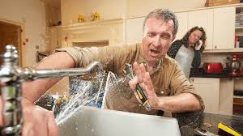

---

layout: ../../layouts/BlogPostLayout.astro
title: 'Tips Every Homeowner Should Know'
pubDate: 2025-21-12
description: 'This blog gives tips that homeowners should keep in mind regarding plumbing'
author: 'Matthew Zhang'
cover: './man-getting-splashed.jpg'
coverAlt: 'Man getting sprayed in the face with water'

---

# Essential Plumbing Tips Every Homeowner Should Know
Understanding basic plumbing can save you thousands in repairs and prevent major headaches. Here are the most critical tips for maintaining your home's plumbing system.

# Know Your Main Water Shut-Off Valve
This is the most important thing you need to know. In an emergency—a burst pipe or major leak—every second counts. Your main shut-off valve is typically where the water line enters your home, often in the basement or near the water heater. Make sure everyone in your household knows its location.

# Watch What Goes Down the Drain
Never flush wipes (even "flushable" ones), feminine products, or cotton swabs. In the kitchen, avoid pouring grease, coffee grounds, or fibrous foods down drains. Grease solidifies in pipes, while items like pasta expand with water and cause blockages.

# Fix Small Leaks Immediately
A dripping faucet might seem minor, but it wastes thousands of gallons annually and often indicates a deteriorating seal that will worsen. Even small leaks can cause hidden water damage and mold growth over time.

# Maintain Your Water Heater
Flush your water heater tank annually to remove sediment buildup. Check the pressure relief valve periodically, and if your unit is over 10-12 years old, start planning for replacement before it fails unexpectedly.

# Don't Overtighten Connections
Over-tightening can crack pipes and strip threads. When installing fixtures, tighten until snug, then add just a quarter turn more. Hand-tight plus a gentle turn with a wrench is usually sufficient.

*Bottom line:* Being proactive with plumbing maintenance protects your home's value and prevents expensive emergencies. When in doubt, call a licensed professional.