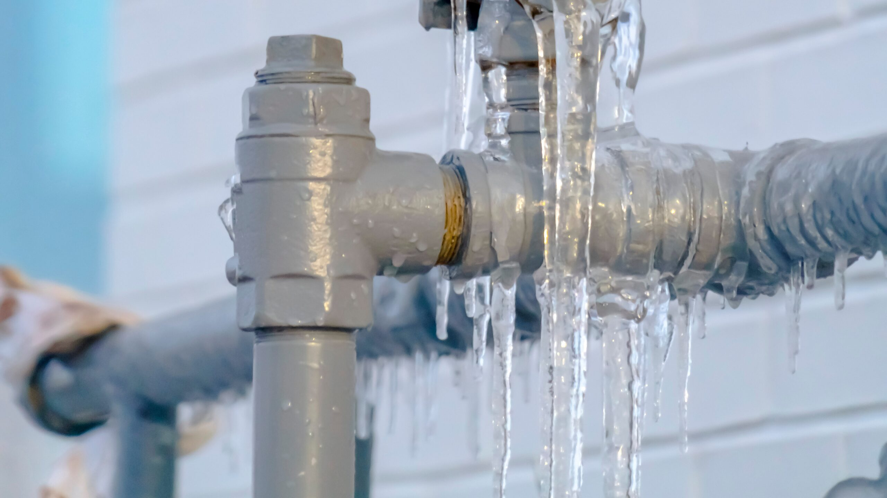

Winter can be tough on your home's plumbing, and frozen pipes are one of the most common and costly problems homeowners face during cold snaps. When water freezes inside your pipes, it expands and can cause them to burst, leading to expensive repairs and significant water damage. The good news? Preventing frozen pipes is easier than you might think.

Here are five simple steps to keep your pipes flowing all winter long:

1. Insulate Exposed Pipes
Pipes in unheated areas like basements, crawl spaces, attics, and garages are most vulnerable to freezing. Wrap them with foam pipe insulation or heat tape, which you can find at any hardware store. Pay special attention to pipes along exterior walls. This small investment can save you thousands in potential damage.

2. Keep Cabinet Doors Open
During extremely cold weather, open the cabinet doors under your sinks, especially those on exterior walls. This allows warm air from your home to circulate around the pipes. It's a simple trick that can make a big difference when temperatures plummet.

3. Let Faucets Drip
When a hard freeze is forecasted, let your faucets drip slightly overnight. Moving water is much less likely to freeze than standing water. You don't need a strong flow—just a small, steady drip from both hot and cold taps is enough to keep water moving through the pipes.

4. Maintain Consistent Indoor Temperature
Resist the temptation to turn down your thermostat too low when you're away or sleeping. Keeping your home at a consistent temperature, even when you're not there, helps ensure pipes stay warm enough. If you're going on vacation, don't set the thermostat below 55°F.

5. Seal Cracks and Openings
Check for gaps around pipes where they enter your home, and seal them with caulk or spray foam insulation. Also look for cracks in your foundation, windows, and doors. These openings let cold air in, which can quickly chill nearby pipes. A little weatherproofing goes a long way.

Taking these preventive measures now can save you from the headache and expense of dealing with burst pipes later. Most of these steps cost little to nothing and take just minutes to complete. Your pipes—and your wallet—will thank you when the temperature drops.

